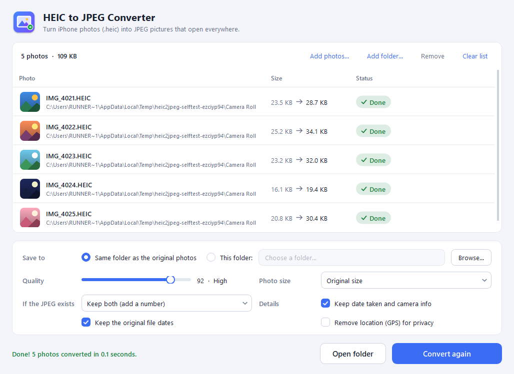

# HEIC to JPEG Converter

A simple, friendly Windows program that turns **HEIC photos** (the format iPhones use) into ordinary **JPEG** pictures that open everywhere.

**No installation needed** — download one file and double-click it.



## Download and run

1. Open the [**Releases**](../../releases) page and download **`HEIC-to-JPEG-Converter.exe`**.
2. Double-click it. That's all — there is nothing to install. You can keep the file anywhere: Desktop, Downloads or a USB stick.

> **"Windows protected your PC"?** Windows shows this for new programs that aren't code-signed.
> Click **More info**, then **Run anyway**. You only need to do this once.

## How to use it

1. **Drag your photos** (or whole folders) onto the window — or click **Choose photos…**.
2. Press **Convert**.
3. Click **Open folder** to see your new JPEGs.

Tip: you can also drop photos straight onto the `.exe` icon to open the program with them already added.

## What it does for you

- **Drag and drop** single photos or entire folders. Sub-folders are searched too.
- **Fast**: converts several photos at the same time.
- **Your originals are never changed or deleted.** If a JPEG with the same name already exists it keeps both (`IMG_0001 (1).jpg`) — or you can choose to replace or skip it.
- **Keeps photo details**: date taken, camera and lens info, and the colour profile, so colours look just like on your iPhone.
- **Correct rotation**: portrait photos stay upright.
- **Privacy option**: remove the GPS location before sharing photos.
- **Shrink photos** if you like, e.g. to 1280 pixels for e-mail.
- **Quality slider** (92 by default — visually identical to the original, much smaller than 100).
- **Keeps the original file dates**, so photos sort the same way in File Explorer.
- Save the JPEGs **next to the originals** or **in a folder of your choice** (folder structure is kept).
- **Light and dark mode** follow your Windows setting.
- **Remembers your settings** between runs.
- **Works offline.** Your photos never leave your computer.

Supported files: `.heic`, `.heif` and `.hif`.

## Questions

**Where are my settings stored?** In `%APPDATA%\HEIC2JPEG\HEIC2JPEG.ini`. Delete that file to reset everything. The program does not write anything else to your system.

**Why is the JPEG bigger than the HEIC?** HEIC is a newer, more efficient format. A JPEG of the same quality is typically 1.5–2× larger. Lower the quality or choose a smaller photo size if file size matters.

**The program takes a few seconds to open.** The single `.exe` unpacks itself each time it starts; that's normal.

---

## For developers

The app is written in Python with [PySide6](https://doc.qt.io/qtforpython-6/) (Qt) for the interface and [pillow-heif](https://github.com/bigcat88/pillow_heif) for decoding HEIC.

```
src/heic2jpeg/
  converter.py        conversion logic (no GUI code; fully unit-tested)
  app.py              entry point
  selftest.py         end-to-end check used by the build pipeline
  gui/                window, photo list, theme, background workers
  resources/          icon and UI images (generated by tools/make_assets.py)
packaging/            PyInstaller recipe for the single-file .exe
tests/                pytest test suite
```

### Run from source

```bat
python -m venv .venv
.venv\Scripts\activate
pip install -e ".[dev]"
python -m heic2jpeg
```

### Run the tests

```bat
pytest
```

### Build the portable .exe

```bat
pip install -e ".[build]"
pyinstaller --noconfirm packaging\heic2jpeg.spec
```

The result is `dist\HEIC-to-JPEG-Converter.exe`. You can check it end to end with
`HEIC-to-JPEG-Converter.exe --selftest report` — it converts sample photos through the real window and writes `report\selftest.txt` plus screenshots.

### Automatic builds and releases

GitHub Actions builds and tests the `.exe` on Windows for every push; download it from the run's **Artifacts**.

To publish a release, raise `__version__` in `src/heic2jpeg/__init__.py` (e.g. to `1.0.1`) and push to the
default branch. The workflow then creates the `v1.0.1` tag and a GitHub Release with `HEIC-to-JPEG-Converter.exe`
attached. Pushing a `v*` tag yourself, or **Actions → Build Windows app → Run workflow** with a version, works too.

## License

Copyright © 2026 deneszalan

This program is free software: you can redistribute it and/or modify it under the terms of the
GNU General Public License as published by the Free Software Foundation, either version 3 of the
License, or (at your option) any later version. See [LICENSE](LICENSE).

The `.exe` also contains open-source components under their own licences, notably Qt / PySide6
(LGPLv3), Pillow (MIT-CMU), pillow-heif (BSD-3-Clause) and, inside it, libheif and libde265 (LGPLv3)
and the x265 encoder (GPLv2 or later). Their source code is available from their projects; the
source of this program is this repository.
